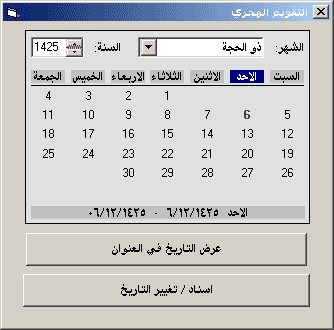



## Hijri Calendar OCX

### Description

Show hijri Calendar (Islamic Calendar)you can download the ocx from

http://www.arabteam2000.com/files/code/files/HijriCalendar.zip

for more info (arabic)

http://www.arabteam2000.com/applib/show.asp?ID=114
 
### More Info
 
Just One Line of Code

Reurns The Hijri Date From Calendar Or Set The Date to view

             |
---                |---
**Submitted On**   |2005-01-15 21:11:02
**By**             |[Mohammed badwi](https://github.com/Planet-Source-Code/PSCIndex/blob/master/ByAuthor/mohammed-badwi.md)
**Level**          |Intermediate
**User Rating**    |3.8 (42 globes from 11 users)
**Compatibility**  |VB 6\.0
**Category**       |[OLE/ COM/ DCOM/ Active\-X](https://github.com/Planet-Source-Code/PSCIndex/blob/master/ByCategory/ole-com-dcom-active-x__1-29.md)
**World**          |[Visual Basic](https://github.com/Planet-Source-Code/PSCIndex/blob/master/ByWorld/visual-basic.md)
**Archive File**   |[Hijri\_Cale1840161152005\.zip](https://github.com/Planet-Source-Code/mohammed-badwi-hijri-calendar-ocx__1-58301/archive/master.zip)

